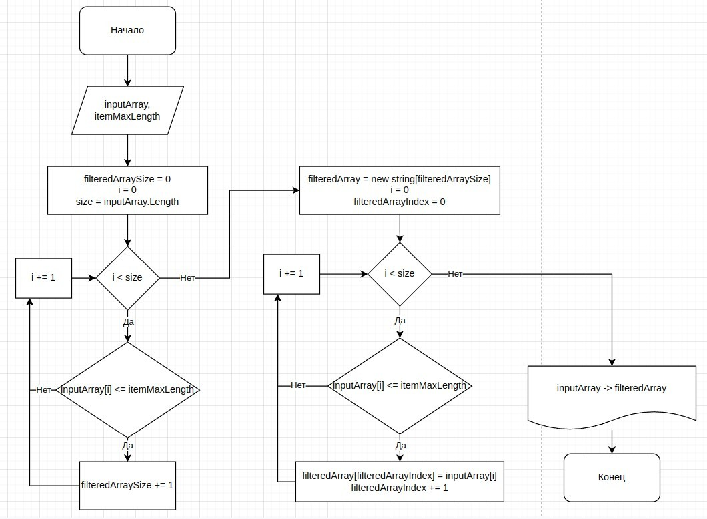

### Условие

Написать программу, которая из имеющегося массива строк формирует новый массив из строк, длина которых меньше, либо равна 3 символам. Первоначальный массив можно ввести с клавиатуры, либо задать на старте выполнения алгоритма. При решении не рекомендуется пользоваться коллекциями, лучше обойтись исключительно массивами.

### Блок-схема

### Описание решения

1. Вводим массив для фильтрации и максимальную длину строки (`inputArray`, `itemMaxLength`)
2. Находим длину отфильтрованного массива (`filteredArraySize`)
    1. Проходим по каждому элементу `inputArray`
    2. Если элементу `inputArray` меньше или равен `itemMaxLength`, `filteredArraySize` увеличиваем на 1
3. Получаем отфильтрованный массив
    1. Создаём пустой массив `filteredArray` длинной `filteredArraySize`
    2. Проходим по каждому элементу `inputArray`
    3. Если элементу `inputArray` меньше или равен `itemMaxLength`, добавляем этот эелемент в `filteredArray`
